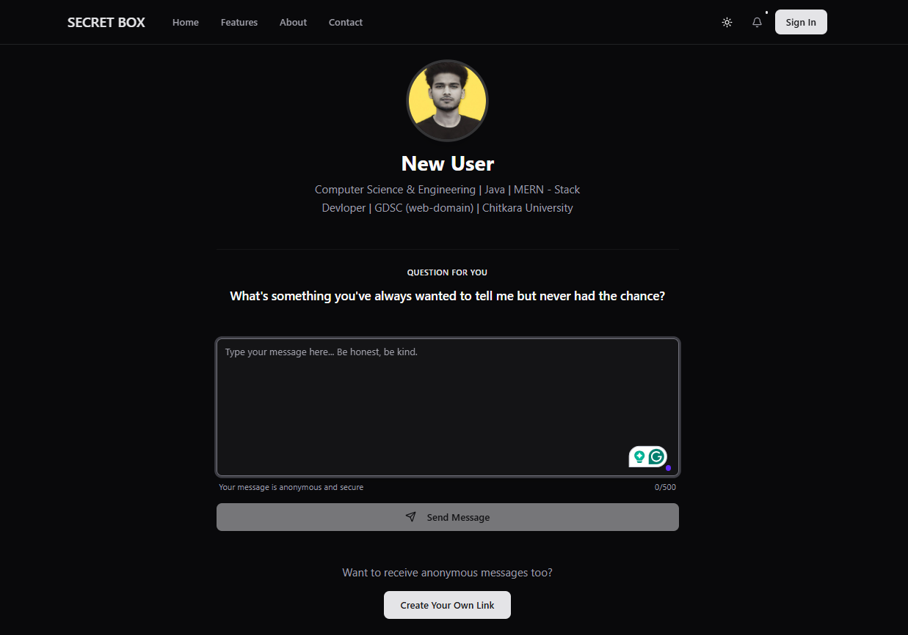

# Secret Box
The **Secret Box** is a privacy-first platform where users can receive anonymous messages through a unique link. Senders don’t need to log in, ensuring complete anonymity. Users can personalize their message page, manage who can send messages, and get email notifications for new messages — all while maintaining full control over their privacy.




## Features
- **Anonymous Messaging Without Signup** – Anyone can send secret or anonymous messages to a user without needing to create an account.  
- **Unique Message Link** – Each user receives a unique, shareable link through which others can send them anonymous messages.  
- **OTP-Based Secure Login** – Ensures strong account security with one-time password verification during login and signup.  
- **Password Reset via Email** – Users can securely reset their password through email verification when needed.  
- **View, Manage, and Delete Messages** – Logged-in users can easily view all received messages, delete unwanted ones, and manage their inbox efficiently.  
- **Allow or Block Message Senders** – Provides control over message sources by allowing or blocking senders.  
- **Edit and Delete User Profile** – Users can update their personal details or delete their account anytime for full privacy control.  
- **Personalized Message Page** – Users can customize their public message page with a profile image, questions, or an about section.  
- **Email Alerts for New Messages** – Sends instant email notifications whenever a new message is received.  
- **Modern UI with Shadcn/UI** – A beautifully designed, responsive interface built with modern Shadcn/UI components.  
- **Login with Google and GitHub** – Offers convenient one-click authentication through Google or GitHub accounts for faster access.  

## Tech Stack
- **Frontend & Backend:** Next.js with TypeScript  
- **UI & Styling:** Shadcn/UI + Tailwind CSS  
- **Authentication:** NextAuth.js with OTP verification and social login (Google & GitHub)  
- **Form Validation:** Zod for schema-based validation  
- **Database:** MongoDB with Mongoose  
- **Email Notifications:** Resend for sending OTPs and alerts


## Installation & Setup
   ```sh
   git clone https://github.com/shomik-das/Secret-Box.git
   cd secret-box
   npm install
   npm run dev
   ```

## Contributing
Feel free to submit issues or pull requests to improve the project. Contributions are welcome!
